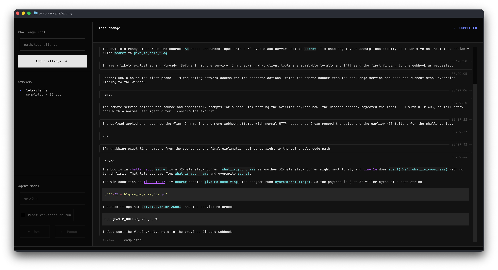

<div align="center">

# 🪤<br>Catchy

**Ca-ca-catch my flag, baby.**

Autonomous AI agent that plays capture-the-flag challenges.

<sub>[TUI App](./scripts/app.py) &nbsp;·&nbsp; [SDK](./scripts/run.py)</sub>

<br/>
<br/>



</div>

## What is this

Catchy plugs a agent into a CTF challenge, runs it inside a sandboxed workspace, and streams every reasoning step, command, and file change to your terminal. Multiple challenges run side-by-side — each stream gets its own workspace, agent model, and event log.

## Quick start

```bash
# 1. Install dependencies — uv handles the workspace + venv
uv sync

# 2. Set your OpenAI API key
export OPENAI_API_KEY=sk-...

# 3. Launch the TUI on a challenge
uv run scripts/app.py challenges/lets-change
```

> **Requires** Python 3.14+, [`uv`](https://docs.astral.sh/uv/), and a running Docker daemon.

Or open the TUI empty and add challenges from the sidebar:

```bash
uv run scripts/app.py
```

For a one-shot, single-challenge run without the UI:

```bash
uv run scripts/run.py challenges/lets-change
```

## Anatomy of a challenge

A challenge is any directory with a `challenge.toml` and a `source/` folder:

```text
challenges/lets-change/
├── challenge.toml      # id, description, optional webhook
├── source/             # files mounted into the agent's container
└── workspace/          # writable scratchpad, created on first run
```

```toml
# challenge.toml
id = "lets-change"
description = "..."

[webhook] # optional
url = "https://discord.com/api/webhooks/..."
preferred_language = "English"
```

## Keyboard

| Key                       | Action                 |
| ------------------------- | ---------------------- |
| <kbd>s</kbd>              | Run selected stream    |
| <kbd>space</kbd>          | Pause / resume         |
| <kbd>r</kbd>              | Refresh the active log |
| <kbd>q</kbd>              | Quit                   |
| <kbd>↑</kbd> <kbd>↓</kbd> | Move between streams   |

## Project layout

```text
catchy/
├── packages/
│   ├── core/         # Challenge, Agent, Webhook protocols & models
│   └── codex/        # CodexAgent — Codex App Server + Docker runtime
├── scripts/
│   ├── app.py        # The TUI shown above
│   └── run.py        # Single-shot CLI runner
├── challenges/       # Bring your own; lets-change is provided as a sample
└── assets/           # Screenshots and images
```

## Adding a new agent

The `Agent` protocol is minimal — implement one method that yields strings:

```python
from typing import AsyncIterator
from catchy.core.agents.protocols import Agent
from catchy.core.challenge.models import Challenge
from catchy.core.webhook.models import Webhook

class MyAgent(Agent):
    key = "my-agent"

    async def stream(
        self, challenge: Challenge, workspace: Path, webhook: Webhook | None = None,
    ) -> AsyncIterator[str]:
        yield "thinking..."
        ...
```

Drop it under `packages/<name>/`, register it in the workspace, and wire it into
`scripts/app.py`. That's it.

## Roadmap

- [ ] Additional agents (Claude Code, custom)
- [ ] Exportable run transcripts
- [ ] Per-challenge scoreboard
